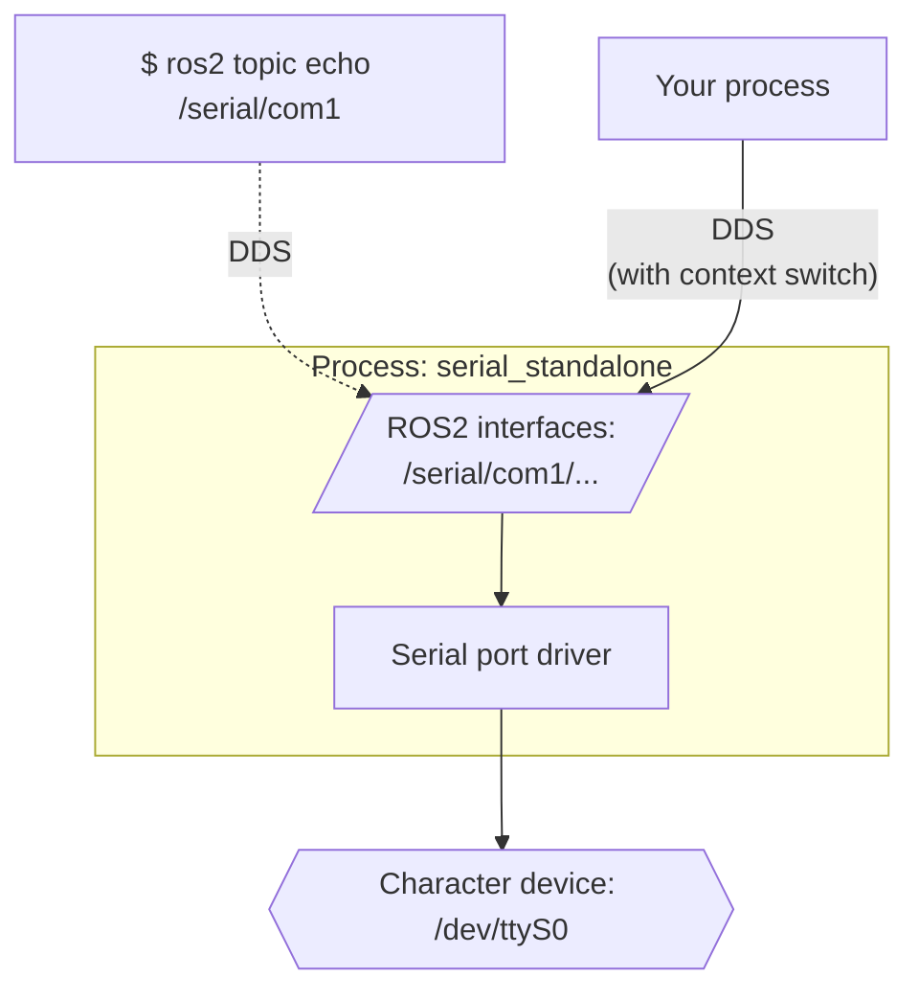
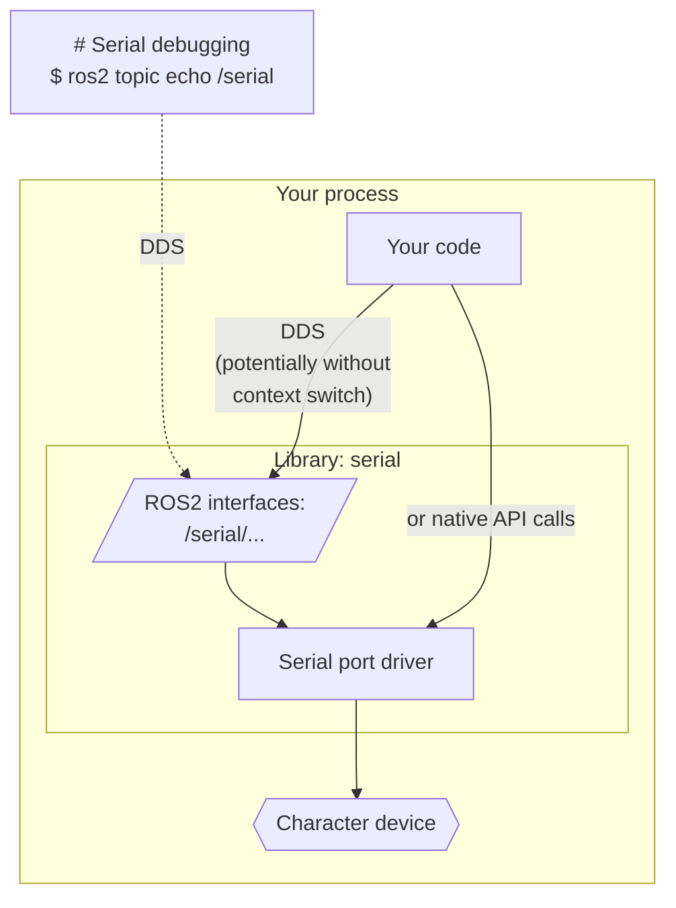

# OpenVMP

[](https://opensource.org/licenses/Apache-2.0)

## ROS2 serial driver

This is an ultimate C++ implementation of serial port driver for ROS2.

It can be used either as a library or a standalone process. In both cases it
provides ROS2 interfaces for inter-process access, introspection and
debugging.
It performs wisely in case of serial line saturation in any of
the I/O directions, minimizing data loses and blocking behavior,
ensuring maximum performance.

It's a part of [the OpenVMP project](https://github.com/openvmp/openvmp).
But it's designed to be universal and usable everywhere.

### Basic setup

Launch it as a separate node for each serial port:

```
$ ros2 run serial serial_standalone
```

or

```
$ ros2 run serial serial_standalone \
  --ros-args \
  --remap serial:__node:=serial_com1 \
  -p interface_prefix:=/serial/com1 \
  -p dev_name:=/dev/ttyS0 \
  -p baud_rate:=115200 \
  -p data:=8 \
  -p parity:=false \
  -p stop:=1 \
  -p flow_control:=true
```



### Advanced setup

The more advanced setup is to initialize it as a node in the executable that will be communicating with it all the time (e.g. an RS485 implementation).

This setup allows DDS to forward the messages between nodes without context switches should your DDS implementation support this.
See an example of such a setup in the Modbus RTU package:




### Implementation details


