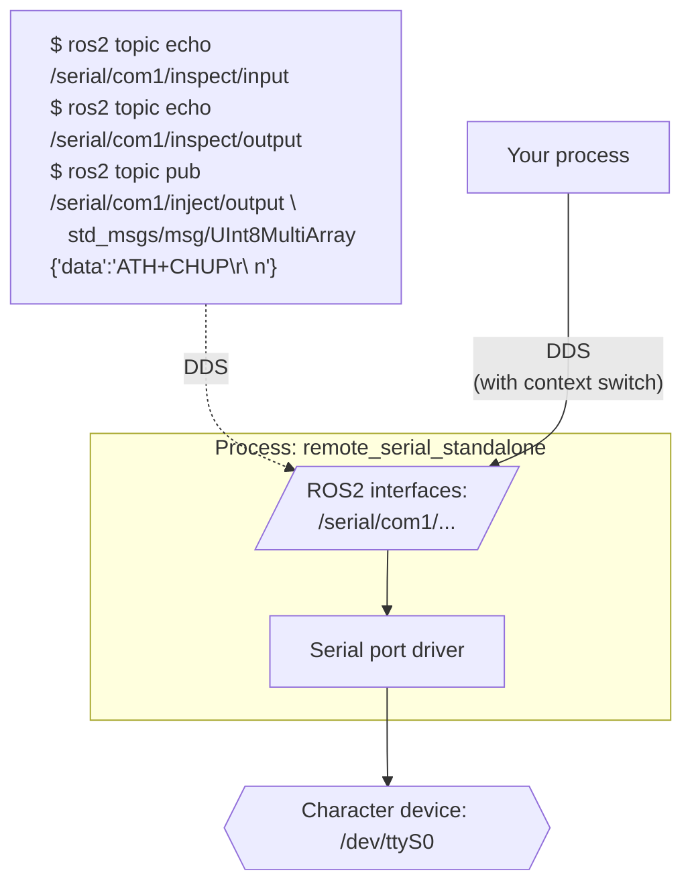
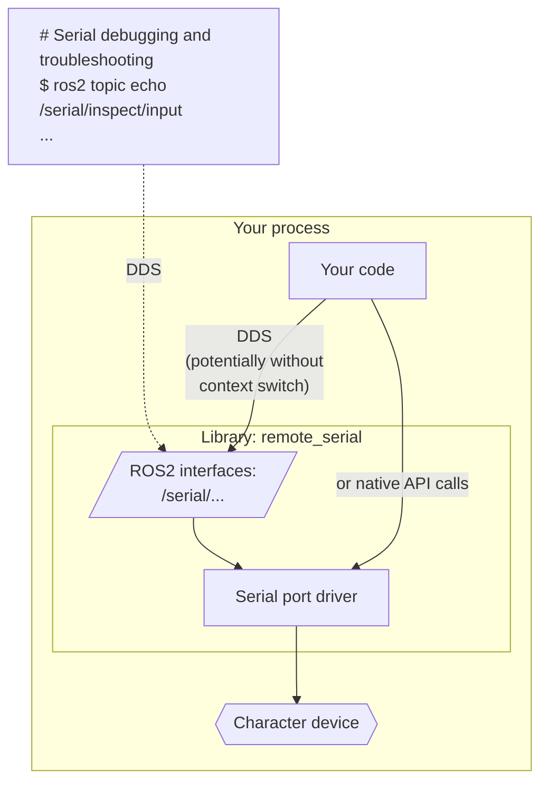
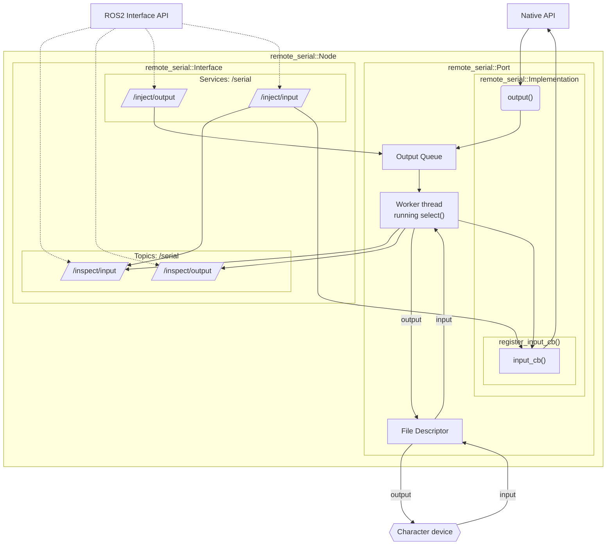

# remote_serial

[](./LICENSE.txt)

This is an ultimate implementation of serial line interface for ROS2.

It provides ROS2 interfaces for inter-process access, introspection and
debugging.
It performs wisely in case of serial line saturation in any of
the I/O directions, minimizing data loses and blocking behavior,
ensuring optimum performance.

This package implements a generic purpose serial port driver using
character device files.
However this package also implements most of the logic required for other
serial line drivers (see the "Examples" section below).

## ROS2 interfaces

### Parameters

All classes:

- `serial_prefix`: the prefix to ROS2 interfaces exposed by this driver
  ("/serial/&lt;node-name&gt;" by default)

The factory class:

- `serial_is_remote`: instructs whether
  to instantiate the driver locally or to connect to a remote instance
  ("true" by default)

Serial port driver:

- `serial_dev_name`: the character device path ("/dev/ttyS0" by default)
- serial port settings:
  - `serial_skip_init`: skip the port initialization (ignore the below parameters)
  - `serial_baud_rate`: baud rate ("115200" by default)
  - `serial_data`: data bits ("8" by default)
  - `serial_parity`: parity bit ("false" by default)
  - `serial_stop`: stop bits ("1" by default)
  - `serial_flow_control`: hardware flow control ("false" by default)
  - `serial_sw_flow_control`: software flow control ("false" by default)
  - `serial_bs`: the size of read buffer ("1024" by default)

### Topics

#### Subscribers

- `<namespace>/<serial_prefix>/inject/input`: injects the given bytes into
  the serial line as if it was written to the line by the driver
- `<namespace>/<serial_prefix>/inject/output`: injects the given bytes into
  the serial line as if it was received by the driver from the line

#### Publishers

- `<namespace>/<serial_prefix>/inspect/input`: publishes data
  received by the driver from the line
- `<namespace>/<serial_prefix>/inspect/output`: publishes data
  sent by the driver to the line

## Basic setup

Launch it as a separate node for each serial port:

```
$ ros2 run remote_serial remote_serial_standalone
```

or

```
$ ros2 run remote_serial remote_serial_standalone \
  --ros-args \
  --remap serial:__node:=serial_com1 \
  -p serial_is_remote:=false \
  -p serial_prefix:=/serial/com1 \
  -p serial_dev_name:=/dev/ttyS0 \
  -p serial_baud_rate:=115200 \
  -p serial_data:=8 \
  -p serial_parity:=false \
  -p serial_stop:=1 \
  -p serial_flow_control:=true
```



## Advanced setup

The more advanced setup is to initialize it as a separate node in the very executable which will be communicating with the port all the time
(e.g. a MODBUS RTU implementation).

This setup allows DDS to forward the messages between nodes
without context switches should your DDS implementation support that.
See an example of such a setup in the Modbus RTU package:




## Implementation details

The following diagram shows the high level view on the internals of this package:



## Implementing serial line drivers

The serial line drivers implement the base class provided by this package.
For C++ drivers, that means that they use
`remote_serial::Implementation` as a parent class.
Its constructor requires an instance of `rclcpp::Node` to read the
parameters from.

<i>
Note:
There can be more than one instance of `remote_serial::Implementation`
per node. However they will all be controlled by the same parameters.
Though the default value of the parameter `serial_prefix` can be passed
into each individual constructor which is sufficient for common use cases.
</i>
<br/>
<br/>

The following methods need to be implemented by each driver:

```c++
public:
  // output writes bytes to the serial line
  virtual void output(const std::string &) override;

  // register_input_cb is used to set the callback function which
  // is called every time data is received from the serial line
  virtual void register_input_cb(void (*)(const std::string &msg,
                                          void *user_data),
                                 void *user_data) override;
```

The users can chose one of three ways to interact with child classes of `remote_serial::Implementation`:

- Link with the driver directly to make native API calls:

  ```c++
  auto serial = \
    std::make_shared<driver_package::DriverClass>(node, "/serial");
  serial->output("ATH+CHUP\r\n");
  ```

  In this case the driver is running within the same process and it is
  destroyed when the `serial` object is destroyed.

- Link with `remote_serial` to make ROS2 interface (DDS) calls
  (locally or over a network):

  ```c++
  auto serial = \
    std::make_shared<remote_serial::RemoteInterface>(node, "/serial");
  serial->output("ATH+CHUP\r\n");
  ```

  In this case the driver can be elsewhere within DDS' reach
  (same process or another side of the globe).

- Let the runtime make the choice between the above two options:

  ```c++
  auto serial = \
    remote_serial::Factory::New(node, "/serial");
  // or
  auto serial = \
    driver_package::Factory::New(node, "/serial");
  ```

  In this case the boolean value of the parameter `serial_is_remote`
  determines whether the driver is instantiated locally or if a remote
  interface is used to reach the driver instantiated elsewhere.
  Please, note, the trivial class `driver_package::Factory`
  (similar to `remote_serial::Factory`) has to be written
  to support this use case.

## Examples

### remote_microcontroller

See the UART implementation in
[remote_microcontroller](https://github.com/openvmp/microcontroller)
for an example of a driver that implements `remote_serial`.
